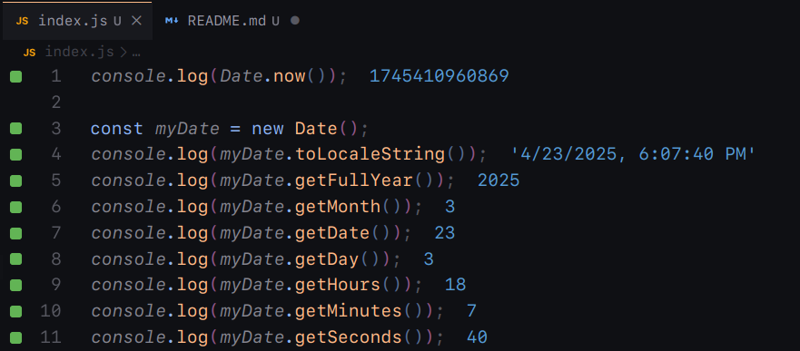

# Date and Time in JavaScript

- In JavaScript the time is stored as milliseconds since the Unix epoch `January 1, 1970`.
- `Date.now()` returns the current timestamp in milliseconds.
- The `Date` object is used to work with date and time.
- A new `Date` object can be created using the `new Date()` constructor.

## Some Useful Methods and Their Output

